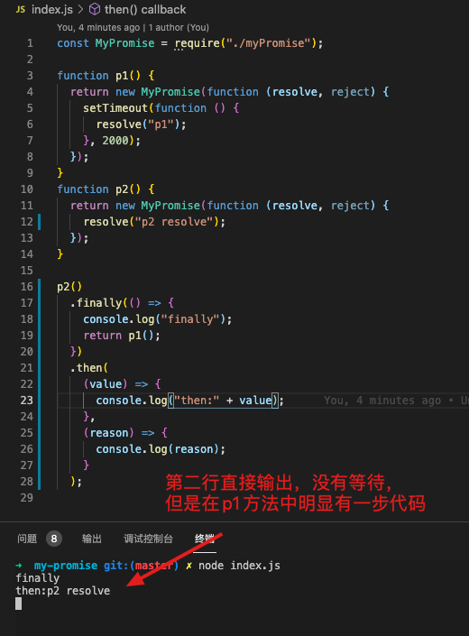

# 一、概述

finally()方法用来制定不管 Promise 对象最后状态如何，都会执行的操作

```javascript
promise
.then( result => {…} )
.catch( error => {…} )
.finally(()=> {…});
```

finally 方法有两个特点：
1、当前 promise 对象的状态无论是成功还是失败，finally 中的回调函数始终会被执行一次。
2、finally 方法后面链式调用 then 方法能够拿到当前 promise 对象最终返回的结果。

实现思路：
finally 方法不是一个静态方法，它需要定义在 Promise 类的原型对象上。在 finally 方法内部，需要知道 promise 对象状态（调用 this.then 方法得到状态)；要实现在 finally 方法后可以链式调用 then，就需要返回一个 promise 对象，而调用的 this.then 方法本身就返回的是一个 promise 对象

注意事项：需要处理在 finally 方法中 return 一个 promise 对象的情况。需要借助 resolve 方法，将 callback 方法执行的结果传递进去，无论 finally 方法中返回的是普通值还是 promise，都将其转化成 promise，然后执行这个 promise。

# 二、踩坑记录

```javascript
finally(callback) {
    return this.then(
      (value) => {
        callback();
        return value;
      },
      (reason) => {
        callback();
        throw reason;
      }
    );
  }
```



更改如下：

```javascript
finally(callback) {
    return this.then(
      (value) => {
        return MyPromise.resolve(callback().then(() => value));
      },
      (reason) => {
        return MyPromise.resolve(
          callback().then(() => {
            throw reason;
          })
        );
      }
    );
  }
```

# 三、完整的 类 MyPromise

```javascript
const PENDING = "pending";
const FULFILLED = "fulfilled";
const REJECTED = "rejected";

class MyPromise {
  constructor(executor) {
    try {
      executor(this.resolve, this.reject);
    } catch (e) {
      this.reject(e);
    }
  }
  // promise状态
  status = PENDING;
  // 成功之后的值
  value = undefined;
  // 失败后的原因
  reason = undefined;
  // 成功回调
  successCallback = [];
  // 失败回调
  failCallback = [];

  // 把resolve和reject用箭头函数写，使this指向promise的实例对象
  resolve = (value) => {
    if (this.status !== PENDING) return;
    // 将状态更改为成功
    this.status = FULFILLED;
    // 保存成功之后的值
    this.value = value;
    // 判断成功回调是否存在，如果存在 调用
    while (this.successCallback.length) this.successCallback.shift()();
  };
  reject = (reason) => {
    if (this.status !== PENDING) return;
    this.status = REJECTED;
    // 保存失败后的原因
    this.reason = reason;
    while (this.failCallback.length) this.failCallback.shift()();
  };
  then(successCallback, failCallback) {
    successCallback = successCallback ? successCallback : (value) => value;
    failCallback = failCallback
      ? failCallback
      : (reason) => {
          throw reason;
        };
    let promise2 = new MyPromise((resolve, reject) => {
      if (this.status === FULFILLED) {
        setTimeout(() => {
          try {
            let x = successCallback(this.value);
            resolvePromise(promise2, x, resolve, reject);
          } catch (e) {
            reject(e);
          }
        }, 0);
      } else if (this.status === REJECTED) {
        setTimeout(() => {
          try {
            let x = failCallback(this.reason);
            resolvePromise(promise2, x, resolve, reject);
          } catch (e) {
            reject(e);
          }
        }, 0);
      } else {
        // 等待
        // 将成功回调和失败回调存储
        this.successCallback.push(() => {
          setTimeout(() => {
            try {
              let x = successCallback(this.value);
              resolvePromise(promise2, x, resolve, reject);
            } catch (e) {
              reject(e);
            }
          }, 0);
        });
        this.failCallback.push(() => {
          setTimeout(() => {
            try {
              let x = failCallback(this.reason);
              resolvePromise(promise2, x, resolve, reject);
            } catch (e) {
              reject(e);
            }
          }, 0);
        });
      }
    });
    return promise2;
  }
  finally(callback) {
    return this.then(
      (value) => {
        return MyPromise.resolve(callback().then(() => value));
      },
      (reason) => {
        return MyPromise.resolve(
          callback().then(() => {
            throw reason;
          })
        );
      }
    );
  }
  static all(array) {
    let result = [];
    let index = 0;

    return new MyPromise((resolve, reject) => {
      function addData(key, value) {
        result[key] = value;
        index++;
        if (index === array.length) {
          resolve(result);
        }
      }
      for (let i = 0; i < array.length; i++) {
        let current = array[i];
        if (current instanceof MyPromise) {
          // promise对象
          current.then(
            (value) => addData(i, value),
            (reason) => reject(reason)
          );
        } else {
          // 普通值
          addData(i, array[i]);
        }
      }
    });
  }
  static resolve(value) {
    if (value instanceof MyPromise) return value;
    return new MyPromise((resolve) => resolve(value));
  }
}

function resolvePromise(promise2, x, resolve, reject) {
  if (promise2 === x) {
    // 返回了自己
    return reject(
      new TypeError("Chaining cycle detected for promise #<Promise>")
    );
  }
  if (x instanceof MyPromise) {
    // 下面两种方法均可
    // x.then(
    //   (value) => resolve(value),
    //   (reason) => reject(reason)
    // );
    x.then(resolve, reject);
  } else {
    // 普通值
    resolve(x);
  }
}
module.exports = MyPromise;
```
