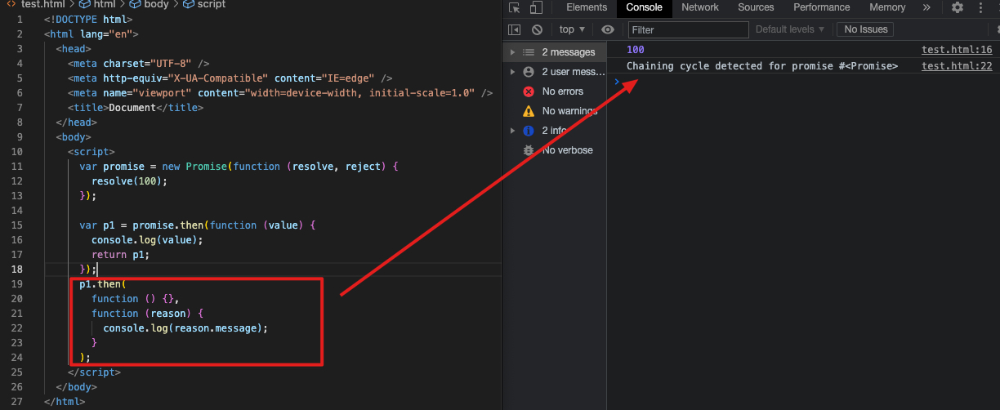

# 一、引言

在 then 方法中是可以返回 promise 对象的，但是在 then 方法的回调函数中不能返回当前 then 方法所返回的 promise 对象。否则会发生循环调用。这种情况需要被识别并进行预先处理

# 二、原生 Promise 的处理




# 三、实现步骤

resolvePromise 方法增加参数，将当前 then 方法所返回的 promise 对象传入，与回调函数所返回的值进行比较就可以判断是否返回了当前 then 方法所返回的 promise 对象。这种情况就需要在 resolvePromise 方法中抛错。

注意将 promise 对象传入 resolvePromise 方法时还无法获取到这个值，需要变成异步代码。

```javascript
// myPromise.js
const PENDING = "pending";
const FULFILLED = "fulfilled";
const REJECTED = "rejected";

class MyPromise {
  constructor(executor) {
    executor(this.resolve, this.reject);
  }
  // promise状态
  status = PENDING;
  // 成功之后的值
  value = undefined;
  // 失败后的原因
  reason = undefined;
  // 成功回调
  successCallback = [];
  // 失败回调
  failCallback = [];

  // 把resolve和reject用箭头函数写，使this指向promise的实例对象
  resolve = (value) => {
    if (this.status !== PENDING) return;
    // 将状态更改为成功
    this.status = FULFILLED;
    // 保存成功之后的值
    this.value = value;
    // 判断成功回调是否存在，如果存在 调用
    // this.successCallback && this.successCallback(this.value)
    while (this.successCallback.length)
      this.successCallback.shift()(this.value);
  };
  reject = (reason) => {
    if (this.status !== PENDING) return;
    this.status = REJECTED;
    // 保存失败后的原因
    this.reason = reason;
    // this.failCallback && this.failCallback(this.reason);
    while (this.failCallback.length) this.failCallback.shift()(this.reason);
  };
  then(successCallback, failCallback) {
    let promise2 = new MyPromise((resolve, reject) => {
      if (this.status === FULFILLED) {
+       setTimeout(() => {
          let x = successCallback(this.value);
          // 判断x的值是普通值还是promise对象
          // 如果是普通值，直接调用resolve
          // 如果是promise对象，查看promise对象返回的结果
          // 再根据promise对象返回的结果决定调用resolve还是reject
          // 此处是在实例化promise2过程中获取promise2的，获取不到。（promise2要在实例化完成之后才有值）,解决方法是变成异步代码
-         resolvePromise(x, resolve, reject);
+         resolvePromise(promise2, x, resolve, reject);
+       }, 0);
      } else if (this.status === REJECTED) {
        failCallback(this.reason);
      } else {
        // 等待
        // 将成功回调和失败回调存储
        this.successCallback.push(successCallback);
        this.failCallback.push(failCallback);
      }
    });
    return promise2;
  }
}
// resolvePromise增加promise2参数
function resolvePromise(promise2, x, resolve, reject) {
+ if (promise2 === x) {
+   // 返回了自己
+   return reject(
+     new TypeError("Chaining cycle detected for promise #<Promise>")
+   );
+ }
  if (x instanceof MyPromise) {
    // 下面两种方法均可
    // x.then(
    //   (value) => resolve(value),
    //   (reason) => reject(reason)
    // );
    x.then(resolve, reject);
  } else {
    // 普通值
    resolve(x);
  }
}
module.exports = MyPromise;
```

```javascript
// index.js
const MyPromise = require("./myPromise");
let promise = new MyPromise((resolve, reject) => {
  resolve("成功");
});

let p1 = promise.then((value) => {
  console.log(value);
  // return 100
  // return other();
  return p1;
});

p1.then(
  (value) => {
    console.log(value);
  },
  (reason) => {
    console.log(reason);
  }
);
```
