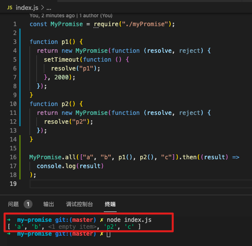

# 一、实现思路

首先，all 方法的调用是 Promise.all()，即类 Promise 中的一个静态方法。此方法接受一个数组，在循环这个数组时，需要判断该元素是普通值还是 promise 对象。如果是普通值，就直接放入结果数组中，如果是 promise 对象，就先去执行这个 promise 对象，再把执行结果放入结果数组中。

注意事项：需要考虑传入的 promise 对象里有异步代码的情况

# 二、踩坑记录

```javascript
  static all(array) {
    let result = [];
    function addData(key, value) {
      result[key] = value;
    }
    return new MyPromise((resolve, reject) => {
      for (let i = 0; i < array.length; i++) {
        let current = array[i];
        if (current instanceof MyPromise) {
          // promise对象
          current.then(
            (value) => addData(i, value),
            (reason) => reject(reason)
          );
        } else {
          // 普通值
          addData(i, array[i]);
        }
      }
      resolve(result);
    });
  }
```

调试结果如下图所示，p1 方法中因为有异步代码，因此在异步代码未执行完成就赋值了结果数组，导致输出的值是个空值。



更改代码如下图，resolve(result)放到 addData 方法里执行，由于 addData 方法要用到 resolve 方法，所以需要移动到了 for 循环里。

```javascript
static all(array) {
    let result = [];
    let index = 0;

    return new MyPromise((resolve, reject) => {
      function addData(key, value) {
        result[key] = value;
        index++;
        if (index === array.length) {
          resolve(result);
        }
      }
      for (let i = 0; i < array.length; i++) {
        let current = array[i];
        if (current instanceof MyPromise) {
          // promise对象
          current.then(
            (value) => addData(i, value),
            (reason) => reject(reason)
          );
        } else {
          // 普通值
          addData(i, array[i]);
        }
      }
    });
  }

```

# 三、完整的 类 MyPromise

```javascript
const PENDING = "pending";
const FULFILLED = "fulfilled";
const REJECTED = "rejected";

class MyPromise {
  constructor(executor) {
    try {
      executor(this.resolve, this.reject);
    } catch (e) {
      this.reject(e);
    }
  }
  // promise状态
  status = PENDING;
  // 成功之后的值
  value = undefined;
  // 失败后的原因
  reason = undefined;
  // 成功回调
  successCallback = [];
  // 失败回调
  failCallback = [];

  // 把resolve和reject用箭头函数写，使this指向promise的实例对象
  resolve = (value) => {
    if (this.status !== PENDING) return;
    // 将状态更改为成功
    this.status = FULFILLED;
    // 保存成功之后的值
    this.value = value;
    // 判断成功回调是否存在，如果存在 调用
    while (this.successCallback.length) this.successCallback.shift()();
  };
  reject = (reason) => {
    if (this.status !== PENDING) return;
    this.status = REJECTED;
    // 保存失败后的原因
    this.reason = reason;
    while (this.failCallback.length) this.failCallback.shift()();
  };
  then(successCallback, failCallback) {
    successCallback = successCallback ? successCallback : (value) => value;
    failCallback = failCallback
      ? failCallback
      : (reason) => {
          throw reason;
        };
    let promise2 = new MyPromise((resolve, reject) => {
      if (this.status === FULFILLED) {
        setTimeout(() => {
          try {
            let x = successCallback(this.value);
            resolvePromise(promise2, x, resolve, reject);
          } catch (e) {
            reject(e);
          }
        }, 0);
      } else if (this.status === REJECTED) {
        setTimeout(() => {
          try {
            let x = failCallback(this.reason);
            resolvePromise(promise2, x, resolve, reject);
          } catch (e) {
            reject(e);
          }
        }, 0);
      } else {
        // 等待
        // 将成功回调和失败回调存储
        this.successCallback.push(() => {
          setTimeout(() => {
            try {
              let x = successCallback(this.value);
              resolvePromise(promise2, x, resolve, reject);
            } catch (e) {
              reject(e);
            }
          }, 0);
        });
        this.failCallback.push(() => {
          setTimeout(() => {
            try {
              let x = failCallback(this.reason);
              resolvePromise(promise2, x, resolve, reject);
            } catch (e) {
              reject(e);
            }
          }, 0);
        });
      }
    });
    return promise2;
  }
  static all(array) {
    let result = [];
    let index = 0;

    return new MyPromise((resolve, reject) => {
      function addData(key, value) {
        result[key] = value;
        index++;
        if (index === array.length) {
          resolve(result);
        }
      }
      for (let i = 0; i < array.length; i++) {
        let current = array[i];
        if (current instanceof MyPromise) {
          // promise对象
          current.then(
            (value) => addData(i, value),
            (reason) => reject(reason)
          );
        } else {
          // 普通值
          addData(i, array[i]);
        }
      }
    });
  }
}

function resolvePromise(promise2, x, resolve, reject) {
  if (promise2 === x) {
    // 返回了自己
    return reject(
      new TypeError("Chaining cycle detected for promise #<Promise>")
    );
  }
  if (x instanceof MyPromise) {
    // 下面两种方法均可
    // x.then(
    //   (value) => resolve(value),
    //   (reason) => reject(reason)
    // );
    x.then(resolve, reject);
  } else {
    // 普通值
    resolve(x);
  }
}
module.exports = MyPromise;
```
